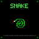

# iDotMatrix overclocked

## Requirements

- iDotMatrix 64x64 pixel display

## Building

```bash
make build
```

## Auto-Discovery

All commands support automatic device discovery. If `--target` is not specified, the tool will scan for nearby iDotMatrix devices (names starting with "IDM-") and connect to the first one found (sorted alphabetically).

## CLI Commands

### snake



Play Snake on the iDot display with progressive difficulty levels.

```bash
./idm-cli snake
```

Options:
- `--target`: Bluetooth MAC address of the display (auto-discovers if not specified)
- `--level`: Starting level (default: 1)

Controls: WASD or Arrow keys to move, Q to quit

### text


Display text on the iDot display with optional animations.

```bash
./idm-cli text --text "HELLO"
```

Options:
- `--target`: Bluetooth MAC address of the display (auto-discovers if not specified)
- `--text` (required): Text to display (uppercase A-Z, 0-9, punctuation)
- `--animation`: Animation type (none, blink, appear, appear-disappear)
- `--color`: Text color (white, red, green, blue, yellow, etc.)
- `--verbose`: Enable verbose debug logging

### fire

Generate and display a DOOM-style fire animation.

```bash
./idm-cli fire
```

Options:
- `--target`: Bluetooth MAC address of the display (auto-discovers if not specified)
- `--verbose`: Enable verbose debug logging

### clock

Show and configure the clock on the iDot display.

```bash
./idm-cli clock
```

Options:
- `--target`: Bluetooth MAC address of the display (auto-discovers if not specified)
- `--time`: Time value in RFC1123Z format (defaults to current time)
- `--style`: Clock style (0:Default, 1:Christmas, 2:Racing, 3:Inverted, 4:Hour Glass)
- `--show-date`: Show date as well as time (default: true)
- `--24hour`: Show time in 24-hour format (default: true)
- `--color`: Clock color (default: white)
- `--verbose`: Enable verbose debug logging

### on

Turn the iDot display on.

```bash
./idm-cli on
```

Options:
- `--target`: Bluetooth MAC address of the display (auto-discovers if not specified)
- `--verbose`: Enable verbose debug logging

### off

Turn the iDot display off.

```bash
./idm-cli off
```

Options:
- `--target`: Bluetooth MAC address of the display (auto-discovers if not specified)
- `--verbose`: Enable verbose debug logging

### discover

Discover nearby Bluetooth devices.

```bash
./idm-cli discover
```

Options:
- `--scan-time`: Max number of seconds to perform scan. 0 means infinite
- `--verbose`: Verbose output during scan

### emoji


Display an animated emoji on the iDot display.

```bash
./idm-cli emoji --name thumbsup
./idm-cli emoji --name party
./idm-cli emoji --name rocket
```

Options:
- `--target`: Bluetooth MAC address of the display (auto-discovers if not specified)
- `--name` (required): Emoji name (thumbsup, thumbsdown, hearthands, clap, joy, rofl, party, scream, rage, scared, mindblow, coldface, hotface, robot, sparkles, tada, 100, confetti, risinghands, rocket, birthday)
- `--verbose`: Enable verbose debug logging

Aliases: `+1` for thumbsup, `-1` for thumbsdown, `lol` for rofl

Emoji animations from [Noto Emoji Animation](https://googlefonts.github.io/noto-emoji-animation/) by Google.

### emoji-slideshow

Display all emojis in a slideshow, cycling through each one.

```bash
./idm-cli emoji-slideshow
./idm-cli emoji-slideshow --interval 5
```

Options:
- `--target`: Bluetooth MAC address of the display (auto-discovers if not specified)
- `--interval`: Seconds to display each emoji (default: 3)
- `--verbose`: Enable verbose debug logging

The slideshow loops forever until interrupted with Ctrl+C.

### grot


Display a Halloween-themed animation on the iDot display.

```bash
./idm-cli grot --name halloween-1
./idm-cli grot --name halloween-3
./idm-cli grot --name halloween-5
```

Options:
- `--target`: Bluetooth MAC address of the display (auto-discovers if not specified)
- `--name` (required): Grot name (halloween-1, halloween-2, halloween-3, halloween-4, halloween-5, halloween-6, halloween-7)
- `--verbose`: Enable verbose debug logging

Grot animations from Giphy.
