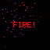
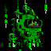

# iDotMatrix overclocked

## Requirements

- iDotMatrix 64x64 pixel display

## Building

```bash
make build
```

## Auto-Discovery

All commands support automatic device discovery. If `--target` is not specified, the tool will scan for nearby iDotMatrix devices (names starting with "IDM-") and connect to the first one found (sorted alphabetically).

## CLI Commands

### snake


Play Snake on the iDot display with progressive difficulty levels.

```bash
./idm-cli snake
```

Options:
- `--target`: Bluetooth MAC address of the display (auto-discovers if not specified)
- `--level`: Starting level (default: 1)

Controls: WASD or Arrow keys to move, Q to quit

### tetris


Play Tetris on the iDot display.

```bash
./idm-cli tetris
```

Options:
- `--target`: Bluetooth MAC address of the display (auto-discovers if not specified)
- `--verbose`: Enable verbose debug logging

Controls: A/Left=Move left, D/Right=Move right, W/Up=Rotate, S/Down=Soft drop, Space=Hard drop, Q=Quit

### text



Display text on the iDot display with optional animations.

```bash
./idm-cli text --text "HELLO"
./idm-cli text --text "FIRE!" --animation fireworks --color red
```

Options:
- `--target`: Bluetooth MAC address of the display (auto-discovers if not specified)
- `--text` (required): Text to display (uppercase A-Z, 0-9, punctuation)
- `--animation`: Animation type (see `--help` for options)
- `--color`: Text color (white, red, green, blue, yellow, etc.)
- `--verbose`: Enable verbose debug logging

### fire


Generate and display a DOOM-style fire animation.

```bash
./idm-cli fire
```

Options:
- `--target`: Bluetooth MAC address of the display (auto-discovers if not specified)
- `--verbose`: Enable verbose debug logging

### clock

Show and configure the clock on the iDot display.

```bash
./idm-cli clock
```

Options:
- `--target`: Bluetooth MAC address of the display (auto-discovers if not specified)
- `--time`: Time value in RFC1123Z format (defaults to current time)
- `--style`: Clock style (0:Default, 1:Christmas, 2:Racing, 3:Inverted, 4:Hour Glass)
- `--show-date`: Show date as well as time (default: true)
- `--24hour`: Show time in 24-hour format (default: true)
- `--color`: Clock color (default: white)
- `--verbose`: Enable verbose debug logging

### on

Turn the iDot display on.

```bash
./idm-cli on
```

Options:
- `--target`: Bluetooth MAC address of the display (auto-discovers if not specified)
- `--verbose`: Enable verbose debug logging

### off

Turn the iDot display off.

```bash
./idm-cli off
```

Options:
- `--target`: Bluetooth MAC address of the display (auto-discovers if not specified)
- `--verbose`: Enable verbose debug logging

### discover

Discover nearby Bluetooth devices.

```bash
./idm-cli discover
```

Options:
- `--scan-time`: Max number of seconds to perform scan. 0 means infinite
- `--verbose`: Verbose output during scan

### emoji


Display an animated emoji on the iDot display.

```bash
./idm-cli emoji --name thumbsup
./idm-cli emoji --name party
./idm-cli emoji --name rocket
```

Options:
- `--target`: Bluetooth MAC address of the display (auto-discovers if not specified)
- `--name` (required): Emoji name (thumbsup, thumbsdown, hearthands, clap, joy, rofl, party, scream, rage, scared, mindblow, coldface, hotface, robot, sparkles, tada, 100, confetti, risinghands, rocket, birthday)
- `--verbose`: Enable verbose debug logging

Aliases: `+1` for thumbsup, `-1` for thumbsdown, `lol` for rofl

Emoji animations from [Noto Emoji Animation](https://googlefonts.github.io/noto-emoji-animation/) by Google.

### demo

Showcase all display features in a continuous slideshow (random order).

```bash
./idm-cli demo
```

Options:
- `--target`: Bluetooth MAC address of the display (auto-discovers if not specified)
- `--verbose`: Enable verbose debug logging

The demo loops forever until interrupted with Ctrl+C.

### showimage

Display a static image (PNG, JPEG, or GIF) on the iDot display. Images are automatically resized to fit the display.

```bash
./idm-cli showimage --image-file photo.png
./idm-cli showimage --image-file logo.jpg --size 32
```

Options:
- `--target`: Bluetooth MAC address of the display (auto-discovers if not specified)
- `--image-file` (required): Path to an image file (PNG, JPEG, GIF)
- `--size`: Display size, 32 or 64 (default: 64)
- `--verbose`: Enable verbose debug logging

### showgif

Display an animated GIF on the 64x64 iDot display. GIFs are automatically resized to fit the display.

```bash
./idm-cli showgif --gif-file animation.gif
```

Options:
- `--target`: Bluetooth MAC address of the display (auto-discovers if not specified)
- `--gif-file` (required): Path to an animated GIF file
- `--verbose`: Enable verbose debug logging

### grot



Display an animation on the iDot display.

```bash
./idm-cli grot --name matrix
./idm-cli grot --name halloween-1
```

Options:
- `--target`: Bluetooth MAC address of the display (auto-discovers if not specified)
- `--name` (required): Grot name (run `./idm-cli grot --help` for available options)
- `--verbose`: Enable verbose debug logging
